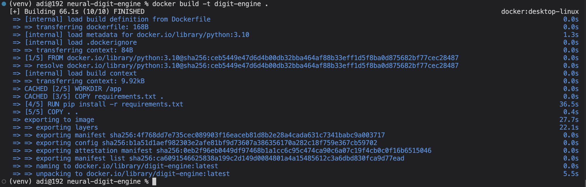
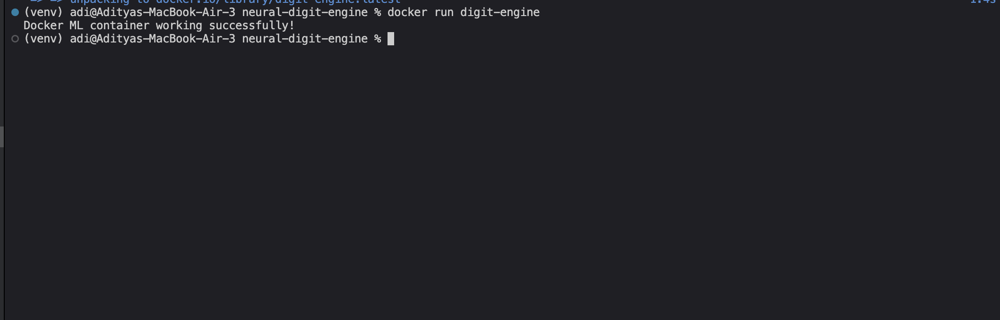
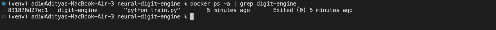

# Neural Digit Engine 🧠⚡

A machine learning-based digit recognition system with a modular architecture, combining model training and Docker-based containerization.

---

## 🚀 Overview

This project demonstrates how to build and organize a digit recognition system using machine learning techniques and run it inside a Docker container.

### Key Features:

* Model training using Python
* Organized project structure (backend, frontend, engine)
* Docker containerization for reproducibility
* Execution of ML pipeline inside container

---

## 🏗️ Project Structure

```
neural-digit-engine/
│── backend/
│── frontend/
│── engine/
│── data/
│── weights/
│── train.py
│── requirements.txt
│── Dockerfile
│── screenshots/
```

---

## ⚙️ Setup Instructions

### 1. Clone Repository

```bash
git clone https://github.com/aadity-dev/neural-digit-engine.git
cd neural-digit-engine
```

---

### 2. Create Virtual Environment

```bash
python3 -m venv venv
source venv/bin/activate
```

---

### 3. Install Dependencies

```bash
pip install -r requirements.txt
```

---

### 4. Run Training

```bash
python train.py
```

---

## 🐳 Docker Usage

### Build Docker Image

```bash
docker build -t digit-engine .
```

---

### Run Docker Container

```bash
docker run digit-engine
```

---

## 📸 Docker Execution Proof

### 🔹 Docker Image Build



---

### 🔹 Running Container



---

### 🔹 Docker PS Output



---

## 🧠 Key Learnings

* Understanding ML workflow (training → execution)
* Containerizing applications using Docker
* Managing dependencies across environments
* Debugging real-world issues like missing libraries and port conflicts

---

## 🎯 Conclusion

This project demonstrates how a machine learning application can be structured and containerized for consistent execution across systems.

---

## 👨‍💻 Author

Aditya 
